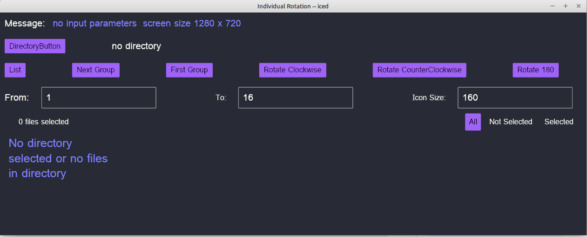

# indivrotate
Rust-Iced program to rotate images you select

I converted one function in photorotate180 from using gtk4 to iced.

This has been modified to allow argument input for directory,
because it is now called in photorot1080.

Iced is still being developed so code may change over time.
This program rotates the images you select.

This calls gimp to do rotates, so need some script files (Gimpfiles folder)

This program calls winitsize01 to get the smallest monitor size.

